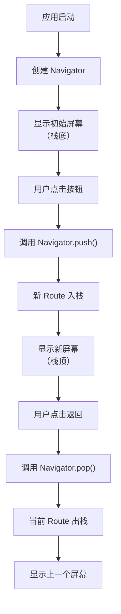
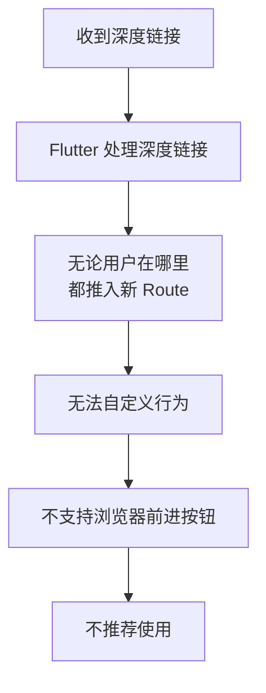
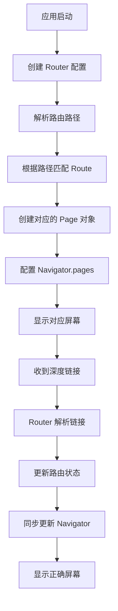
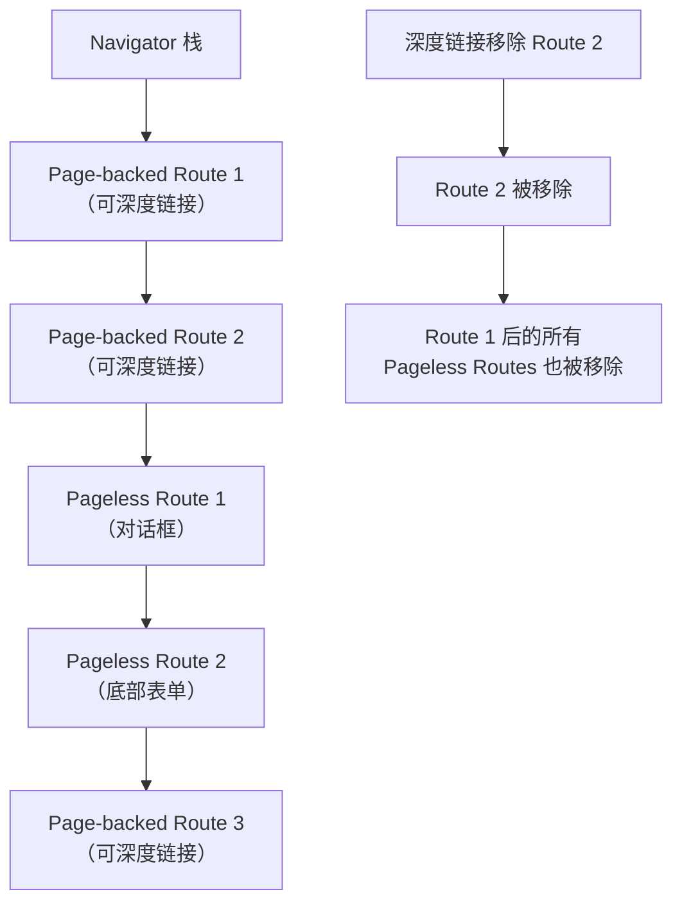
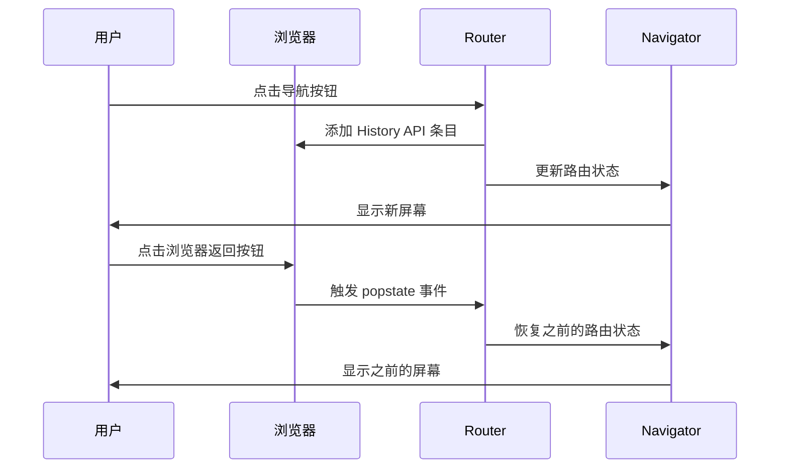
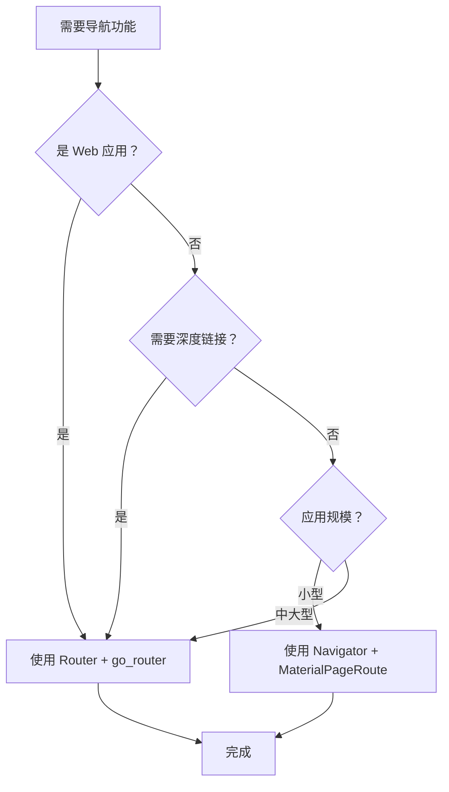

# Flutter 导航和路由系统详解

## 概述

Flutter 提供了完整的导航和路由系统，用于在应用的不同屏幕之间导航，并处理深度链接（deep links）。本文档深入解析 Flutter 导航系统的核心概念、使用方法和最佳实践。

## 核心概念

### 1. Navigator（导航器）

`Navigator` 是 Flutter 中负责管理屏幕堆栈的核心组件。它使用栈（Stack）数据结构来管理路由历史，类似于浏览器中的历史记录栈。

**核心特性**：

- **栈式管理**：`Navigator` 维护一个 `Route` 对象栈，每个 `Route` 代表一个屏幕
- **平台适配**：自动使用目标平台（Android、iOS、Web）的过渡动画
- **命令式 API**：通过 `push()` 和 `pop()` 等方法进行导航

**工作原理**：



### 2. Route（路由）

`Route` 是表示导航目标的抽象类，它定义了如何显示和隐藏屏幕。

**常见类型**：

- **`MaterialPageRoute`**：Material Design 风格的页面路由，提供标准的页面过渡动画
- **`CupertinoPageRoute`**：iOS 风格的页面路由，提供 iOS 风格的过渡动画
- **自定义 Route**：可以继承 `Route` 类创建自定义过渡效果

### 3. Router（路由器）

`Router` 是 Flutter 的高级路由系统，用于处理复杂的导航场景，特别是深度链接和 Web 应用。

**核心特性**：

- **声明式导航**：通过路由配置定义应用的所有路由
- **深度链接支持**：正确处理来自外部（如 URL、通知）的深度链接
- **Web 集成**：与浏览器 History API 集成，支持前进/后退按钮
- **状态同步**：保持路由状态与应用状态同步

### 4. 深度链接（Deep Linking）

深度链接允许用户通过 URL 或外部链接直接访问应用的特定屏幕，而不是从首页开始。

**应用场景**：

- 用户点击分享链接直接打开特定内容
- 从通知跳转到特定页面
- Web 应用中通过 URL 访问不同页面

## 三种导航方式对比

### 方式一：使用 Navigator（基础导航）

**适用场景**：

- 小型应用
- 不需要复杂深度链接
- 简单的屏幕间导航

**代码示例**：

```dart
// 完整的示例代码
import 'package:flutter/material.dart';

void main() {
  runApp(const MaterialApp(title: 'Navigation basics', home: FirstScreen()));
}

class FirstScreen extends StatelessWidget {
  const FirstScreen({super.key});
  @override
  Widget build(BuildContext context) {
    return Scaffold(
      appBar: AppBar(title: const Text('First Screen')),
      body: Center(
        child: ElevatedButton(
          child: const Text('Open second screen'),
          onPressed: () {
            // 使用 Navigator.push() 导航到新屏幕
            Navigator.of(context).push(
              MaterialPageRoute<void>(
                builder: (context) => const SecondScreen(),
              ),
            );
          },
        ),
      ),
    );
  }
}

class SecondScreen extends StatelessWidget {
  const SecondScreen({super.key});
  @override
  Widget build(BuildContext context) {
    return Scaffold(
      appBar: AppBar(title: const Text('Second Screen')),
      body: Center(
        child: ElevatedButton(
          child: const Text('Pop current screen'),
          onPressed: () {
            // 使用 Navigator.pop() 返回上一屏幕
            Navigator.pop(context);
          },
        ),
      ),
    );
  }
}
```

**代码解析**：

1. **`Navigator.of(context)`**：从当前 `BuildContext` 获取最近的 `Navigator` 实例
2. **`push()`**：将新的 `Route` 推入栈顶，显示新屏幕
3. **`MaterialPageRoute`**：Material Design 风格的页面路由，提供滑动过渡动画
4. **`pop()`**：从栈中移除当前 `Route`，返回到上一个屏幕

**优点**：

- 简单直接，易于理解
- 适合小型应用
- 不需要额外配置

**缺点**：

- 不支持深度链接
- 难以处理复杂的导航场景
- Web 应用体验不佳

### 方式二：使用命名路由（Named Routes）

**适用场景**：

- 简单的深度链接需求
- 需要路由名称管理

**代码示例**：

```dart
import 'package:flutter/material.dart';

void main() {
  runApp(
    MaterialApp(
      title: 'Navigation with named routes',
      initialRoute: '/',
      routes: {
        '/': (context) => const FirstScreen(),
        '/second': (context) => const SecondScreen(),
      },
    ),
  );
}

class FirstScreen extends StatelessWidget {
  const FirstScreen({super.key});
  @override
  Widget build(BuildContext context) {
    return Scaffold(
      appBar: AppBar(title: const Text('First Screen')),
      body: Center(
        child: ElevatedButton(
          child: const Text('Open second screen'),
          onPressed: () {
            // 使用路由名称导航
            Navigator.pushNamed(context, '/second');
          },
        ),
      ),
    );
  }
}
```

**代码解析**：

1. **`MaterialApp.routes`**：定义路由名称到 `WidgetBuilder` 的映射
2. **`initialRoute`**：指定应用的初始路由
3. **`pushNamed()`**：通过路由名称进行导航

**局限性**：



**为什么不推荐**：

1. **行为不可定制**：深度链接的处理方式固定，无法根据应用状态调整
2. **不支持浏览器前进按钮**：Web 应用体验不完整
3. **导航逻辑受限**：无法实现复杂的导航场景

**替代方案**：

- 使用 `go_router` 等路由包
- 使用 `Navigator` + `MaterialPageRoute`（如果不需要深度链接）

### 方式三：使用 Router（推荐）

**适用场景**：

- Web 应用
- 需要复杂深度链接
- 多个 `Navigator` 的应用
- 需要精确控制导航状态

**代码示例**：

```dart
import 'package:flutter/material.dart';
import 'package:go_router/go_router.dart';

void main() {
  runApp(
    MaterialApp.router(
      title: 'Navigation with a router',
      routerConfig: _router,
    ),
  );
}

// 声明式路由配置
final _router = GoRouter(
  routes: [
    GoRoute(path: '/', builder: (context, state) => const FirstScreen()),
    GoRoute(path: '/second', builder: (context, state) => const SecondScreen()),
  ],
);

class FirstScreen extends StatelessWidget {
  const FirstScreen({super.key});
  @override
  Widget build(BuildContext context) {
    return Scaffold(
      appBar: AppBar(title: const Text('First Screen')),
      body: Center(
        child: ElevatedButton(
          child: const Text('Open second screen'),
          // 使用声明式导航
          onPressed: () => context.go('/second'),
        ),
      ),
    );
  }
}
```

**代码解析**：

1. **`MaterialApp.router`**：使用 `router` 构造函数替代 `MaterialApp`
2. **`GoRouter`**：`go_router` 包提供的路由配置类
3. **`context.go()`**：声明式导航方法，由 `go_router` 扩展提供

**工作原理**：



**优点**：

- **声明式**：路由配置清晰，易于维护
- **深度链接支持完善**：正确处理各种深度链接场景
- **Web 体验优秀**：与浏览器 History API 集成
- **状态同步**：路由状态与应用状态保持一致

## Router 和 Navigator 的协作

### Page-backed Routes vs Pageless Routes

理解这两种路由类型的区别对于正确使用导航系统至关重要。

**Page-backed Routes（页面支持的路由）**：

- 由 `Router` 或路由包（如 `go_router`）创建
- 基于 `Page` 对象，通过 `Navigator.pages` 参数配置
- **支持深度链接**
- 路由状态可被序列化和恢复

**Pageless Routes（无页面路由）**：

- 通过 `Navigator.push()` 或 `showDialog()` 创建
- 不基于 `Page` 对象
- **不支持深度链接**
- 临时性的路由，如对话框、底部表单等

**关系图**：



**重要规则**：

当 `Page-backed Route` 从 `Navigator` 中移除时，它之后的所有 `Pageless Routes` 也会被自动移除。这确保了导航状态的一致性。

**示例场景**：

```dart
// 假设当前导航栈：
// [HomePage] -> [DetailPage] -> [Dialog] -> [BottomSheet]

// 如果通过深度链接返回到 HomePage
context.go('/');

// 结果：所有在 DetailPage 之后的 Pageless Routes（Dialog、BottomSheet）都会被移除
// 最终栈：[HomePage]
```

## Web 支持

### 浏览器 History API 集成

使用 `Router` 的应用会自动与浏览器 History API 集成，提供完整的 Web 导航体验。

**工作原理**：



**反向时序导航（Reverse Chronological Navigation）**：

当用户使用 `Navigator.pop()` 返回，然后点击浏览器返回按钮时，之前弹出的页面会被重新推入栈中。这确保了导航行为与用户期望一致。

**示例**：

```dart
// 用户操作流程：
// 1. 在 HomePage，点击按钮导航到 DetailPage
context.go('/detail');

// 2. 在 DetailPage，点击应用内的返回按钮
Navigator.pop(context); // 返回到 HomePage

// 3. 用户点击浏览器返回按钮
// 结果：DetailPage 被重新推入栈中（反向时序导航）
```

## 代码示例详解

### 示例 1：基础 Navigator 使用

```dart
// 引用项目中的完整代码
```

```18:22:examples/ui/navigation/lib/navigator_basic.dart
Navigator.of(context).push(
  MaterialPageRoute<void>(
    builder: (context) => const SecondScreen(),
  ),
);
```

**关键点解析**：

1. **`Navigator.of(context)`**：
   - 从 `BuildContext` 向上查找最近的 `Navigator` 祖先
   - 如果找不到，会抛出异常
   - 这是获取 `Navigator` 实例的标准方式

2. **`MaterialPageRoute<void>`**：
   - `<void>` 表示该路由不返回任何数据
   - 如果需要返回数据，可以指定类型，如 `MaterialPageRoute<String>`
   - `builder` 函数在路由被推入栈时调用，用于构建目标屏幕

3. **返回数据示例**：

```dart
// 导航时等待返回结果
final result = await Navigator.of(context).push<String>(
  MaterialPageRoute<String>(
    builder: (context) => const SecondScreen(),
  ),
);

// 在 SecondScreen 中返回数据
Navigator.pop(context, '返回的数据');
```

### 示例 2：使用 go_router

```dart
// 引用项目中的完整代码
```

```14:19:examples/ui/navigation/lib/navigator_router.dart
final _router = GoRouter(
  routes: [
    GoRoute(path: '/', builder: (context, state) => const FirstScreen()),
    GoRoute(path: '/second', builder: (context, state) => const SecondScreen()),
  ],
);
```

**关键点解析**：

1. **路由配置**：
   - `routes` 列表定义了所有可用的路由
   - 每个 `GoRoute` 包含路径和构建器函数
   - 路径支持参数，如 `/user/:id`

2. **导航方法**：
   - `context.go('/path')`：替换当前路由栈
   - `context.push('/path')`：推入新路由
   - `context.pop()`：弹出当前路由

3. **路由参数示例**：

```dart
final _router = GoRouter(
  routes: [
    GoRoute(
      path: '/user/:id',
      builder: (context, state) {
        final userId = state.pathParameters['id']!;
        return UserDetailScreen(userId: userId);
      },
    ),
  ],
);

// 使用
context.go('/user/123');
```

## 最佳实践

### 1. 选择合适的导航方式

**决策流程图**：



### 2. 路由组织建议

**大型应用的路由结构**：

```dart
// 推荐：将路由配置分离到单独文件
// lib/routes/app_router.dart
final appRouter = GoRouter(
  routes: [
    GoRoute(
      path: '/',
      builder: (context, state) => const HomeScreen(),
    ),
    GoRoute(
      path: '/auth',
      routes: [
        GoRoute(
          path: 'login',
          builder: (context, state) => const LoginScreen(),
        ),
        GoRoute(
          path: 'register',
          builder: (context, state) => const RegisterScreen(),
        ),
      ],
    ),
    GoRoute(
      path: '/profile/:userId',
      builder: (context, state) {
        final userId = state.pathParameters['userId']!;
        return ProfileScreen(userId: userId);
      },
    ),
  ],
);
```

### 3. 避免常见错误

**错误 1：在 Page-backed 路由中使用 WillPopScope**

```dart
// ❌ 错误：无法阻止 Page-backed 路由的导航
class DetailScreen extends StatelessWidget {
  @override
  Widget build(BuildContext context) {
    return WillPopScope(
      onWillPop: () async {
        // 这不会在 Page-backed 路由中生效
        return false;
      },
      child: Scaffold(...),
    );
  }
}

// ✅ 正确：使用路由包的 API
// 对于 go_router，使用 redirect 或 onExit
```

**错误 2：混用 Navigator 和 Router API**

```dart
// ⚠️ 注意：可以混用，但需要理解行为
// 使用 Router 导航
context.go('/detail');

// 使用 Navigator 显示对话框（Pageless Route）
showDialog(
  context: context,
  builder: (context) => AlertDialog(...),
);
// 对话框是 Pageless Route，不会影响深度链接
```

### 4. 性能优化建议

1. **延迟加载路由**：对于大型应用，考虑使用路由的懒加载
2. **路由缓存**：合理使用路由缓存，避免重复构建
3. **避免深层嵌套**：保持路由层级合理，避免过深的导航栈

## 常见问题解答

### Q1：什么时候应该使用 Navigator，什么时候使用 Router？

**A**：

- **使用 Navigator**：
  - 小型应用，不需要深度链接
  - 简单的屏幕间导航
  - 临时性路由（对话框、底部表单）

- **使用 Router**：
  - Web 应用
  - 需要深度链接支持
  - 需要精确控制导航状态
  - 中大型应用

### Q2：命名路由为什么不推荐使用？

**A**：命名路由虽然简单，但有以下限制：

1. **行为不可定制**：深度链接处理方式固定
2. **Web 体验差**：不支持浏览器前进按钮
3. **导航逻辑受限**：无法实现复杂场景

推荐使用 `go_router` 等路由包，它们提供了命名路由的便利性，同时解决了上述问题。

### Q3：Page-backed 和 Pageless Routes 的区别是什么？

**A**：

- **Page-backed Routes**：
  - 由 `Router` 创建，基于 `Page` 对象
  - 支持深度链接
  - 路由状态可序列化

- **Pageless Routes**：
  - 通过 `Navigator.push()` 或 `showDialog()` 创建
  - 不支持深度链接
  - 临时性路由（对话框、底部表单等）

### Q4：如何在导航时传递数据？

**A**：有多种方式：

**方式 1：通过构造函数传递（推荐）**

```dart
// 导航时
Navigator.of(context).push(
  MaterialPageRoute(
    builder: (context) => DetailScreen(data: myData),
  ),
);
```

**方式 2：通过路由参数（go_router）**

```dart
// 配置路由
GoRoute(
  path: '/detail/:id',
  builder: (context, state) {
    final id = state.pathParameters['id']!;
    return DetailScreen(id: id);
  },
);

// 导航
context.go('/detail/123');
```

**方式 3：通过返回结果**

```dart
// 导航并等待结果
final result = await Navigator.of(context).push<String>(
  MaterialPageRoute(builder: (context) => const SecondScreen()),
);

// 在目标屏幕返回数据
Navigator.pop(context, '返回的数据');
```

### Q5：如何处理导航拦截（如登录检查）？

**A**：使用路由包的拦截功能：

```dart
final _router = GoRouter(
  redirect: (context, state) {
    final isLoggedIn = AuthService.isLoggedIn;
    final isGoingToLogin = state.matchedLocation == '/login';
    
    if (!isLoggedIn && !isGoingToLogin) {
      return '/login';
    }
    
    if (isLoggedIn && isGoingToLogin) {
      return '/';
    }
    
    return null; // 不重定向
  },
  routes: [
    // 路由配置
  ],
);
```

### Q6：Web 应用中浏览器返回按钮的行为是什么？

**A**：使用 `Router` 的应用会自动与浏览器 History API 集成：

- 每次通过 `Router` 导航时，会添加一个 History 条目
- 点击浏览器返回按钮会触发反向时序导航
- 如果用户使用 `Navigator.pop()` 返回，然后点击浏览器返回，之前弹出的页面会被重新推入

这确保了导航行为与用户期望一致。

## 扩展阅读

### 官方资源

- [Flutter Cookbook - Navigation](https://docs.flutter.dev/cookbook/navigation)：包含多个导航示例
- [Navigator API 文档](https://api.flutter.dev/flutter/widgets/Navigator-class.html)：详细的 API 参考
- [Router API 文档](https://api.flutter.dev/flutter/widgets/Router-class.html)：Router 的完整文档
- [Deep Linking 配置指南](https://docs.flutter.dev/ui/navigation/deep-linking)：深度链接配置方法

### 第三方资源

- [go_router 包](https://pub.dev/packages/go_router)：推荐的 Flutter 路由包
- [Understanding Navigation](https://material.io/design/navigation/understanding-navigation.html)：Material Design 导航设计指南
- [Learning Flutter's new navigation and routing system](https://medium.com/flutter/learning-flutters-new-navigation-and-routing-system-7c9068155ade)：深入理解 Flutter 导航系统

### 相关主题

- **状态管理**：导航状态与应用状态的协调
- **深度链接**：配置 Android 和 iOS 的深度链接
- **Web 集成**：Web 应用的特殊考虑

## 总结

Flutter 的导航系统提供了从简单到复杂的完整解决方案：

1. **Navigator**：适合小型应用的基础导航
2. **命名路由**：不推荐，存在局限性
3. **Router + go_router**：推荐用于大多数应用，特别是需要深度链接和 Web 支持的应用

理解 `Page-backed Routes` 和 `Pageless Routes` 的区别对于正确使用导航系统至关重要。选择合适的导航方式，遵循最佳实践，可以构建出用户体验优秀的 Flutter 应用。
