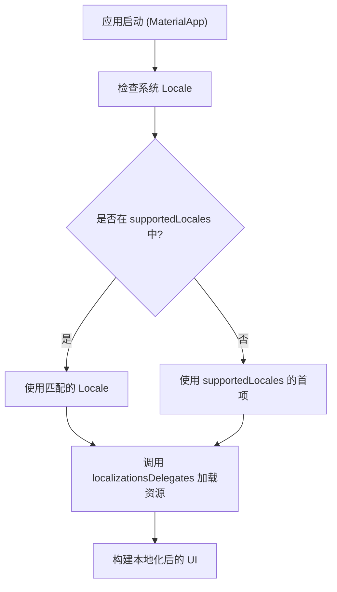

# 第 01 章：基础入门

## 1. 核心概念

在开发支持全球用户的应用时，**国际化 (Internationalization，简称 i18n)** 和 **本地化 (Localization，简称 l10n)** 是两个核心步骤：

* **国际化 (i18n)**：在开发过程中，使应用能够支持多种语言和区域设置的设计过程。这包括将文本硬编码替换为可动态加载的资源。
* **本地化 (l10n)**：针对特定语言或区域，为应用提供翻译和格式化资源（如日期、数字格式）的过程。

Flutter 提供了强大的内置支持，包括 Material 和 Cupertino 组件库的国际化。

## 2. 环境搭建

要在 Flutter 应用中添加国际化支持，首先需要配置依赖项。

### 2.1 添加依赖

在 `pubspec.yaml` 中添加 `flutter_localizations` 和 `intl` 包。`flutter_localizations` 包含了 Flutter 内置组件的翻译，而 `intl` 则提供了复杂的翻译逻辑（如复数和选择器）。

```bash
flutter pub add flutter_localizations --sdk=flutter
flutter pub add intl:any
```

配置完成后的 `pubspec.yaml` 示例：

```yaml
dependencies:
  flutter:
    sdk: flutter
  flutter_localizations:
    sdk: flutter
  intl: any
```

## 3. 基础配置

在应用入口（通常是 `MaterialApp` 或 `CupertinoApp`）中，需要指定 `localizationsDelegates` 和 `supportedLocales`。

### 3.1 关键属性说明

* **`localizationsDelegates`**：定义了如何查找和加载本地化资源的工厂列表。
* **`supportedLocales`**：应用支持的所有区域设置列表。

### 3.2 代码实现

```dart 86:105:src/content/ui/internationalization/index.md
import 'package:flutter_localizations/flutter_localizations.dart';

// ...

return const MaterialApp(
  title: 'Localizations Sample App',
  localizationsDelegates: [
    GlobalMaterialLocalizations.delegate,
    GlobalWidgetsLocalizations.delegate,
    GlobalCupertinoLocalizations.delegate,
  ],
  supportedLocales: [
    Locale('en'), // English
    Locale('es'), // Spanish
  ],
  home: MyHomePage(),
);
```

**代理 (Delegates) 的作用**：

1. `GlobalMaterialLocalizations.delegate`：为 Material 组件库提供本地化字符串（如按钮提示、日期选择器）。
2. `GlobalWidgetsLocalizations.delegate`：定义默认的文字方向（从左到右或从右到左）。
3. `GlobalCupertinoLocalizations.delegate`：为 Cupertino 组件提供翻译。

## 4. 覆盖区域设置 (Overriding Locale)

在某些特殊场景下，你可能希望应用的一部分使用与系统不同的语言。可以使用 `Localizations.override` 构造函数。

```dart 154:185:src/content/ui/internationalization/index.md
Widget build(BuildContext context) {
  return Scaffold(
    appBar: AppBar(title: Text(widget.title)),
    body: Center(
      child: Column(
        mainAxisAlignment: MainAxisAlignment.center,
        children: <Widget>[
          // 强制该部分组件使用西班牙语 ('es')
          Localizations.override(
            context: context,
            locale: const Locale('es'),
            // 使用 Builder 获取更新后的 BuildContext
            child: Builder(
              builder: (context) {
                return CalendarDatePicker(
                  initialDate: DateTime.now(),
                  firstDate: DateTime(1900),
                  lastDate: DateTime(2100),
                  onDateChanged: (value) {},
                );
              },
            ),
          ),
        ],
      ),
    ),
  );
}
```

## 5. 国际化工作流程图

以下流程展示了应用启动时如何加载本地化资源：



## 6. 常见问题解答

**Q: 为什么我运行应用后，日期选择器还是英文的？**

A: 请确保你已经在 `localizationsDelegates` 中添加了 `GlobalMaterialLocalizations.delegate`，并且在 `supportedLocales` 中包含了目标语言。

**Q: `WidgetsApp` 是否支持国际化？**

A: 支持。`WidgetsApp` 是较低级别的类，虽然不直接使用 Material 的翻译，但可以使用相同的 `Localizations` 逻辑。
