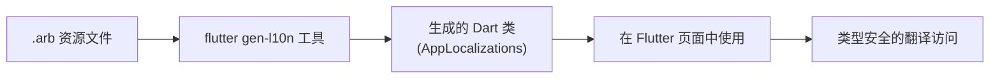

# 第 02 章：gen-l10n 自动化工具

## 1. 简介

虽然可以手动管理翻译，但 Flutter 官方推荐使用 `gen-l10n` 自动化工具。该工具通过读取 `.arb` (App Resource Bundle) 文件，自动生成类型安全的 Dart 代码，极大地方便了开发者在代码中调用翻译内容。

## 2. 配置步骤

### 2.1 启用代码生成

在 `pubspec.yaml` 中的 `flutter` 节点下开启 `generate` 标志：

```yaml 210:214:src/content/ui/internationalization/index.md
# The following section is specific to Flutter.
flutter:
  generate: true # 添加此行以启用代码生成
```

### 2.2 创建配置文件 `l10n.yaml`

在项目根目录下创建 `l10n.yaml` 文件，用于配置工具的行为：

```yaml 220:224:src/content/ui/internationalization/index.md
arb-dir: lib/l10n
template-arb-file: app_en.arb
output-localization-file: app_localizations.dart
```

**参数含义**：

* **`arb-dir`**：指定 `.arb` 翻译文件的存放目录。
* **`template-arb-file`**：用作基础模板的翻译文件，通常为英文。
* **`output-localization-file`**：生成的主要 Dart 代码文件名。

## 3. 准备 ARB 文件

ARB 文件是基于 JSON 格式的资源文件，每一项翻译包含一个“键”和对应的“值”。

### 3.1 创建模板文件 `lib/l10n/app_en.arb`

```json 240:247:src/content/ui/internationalization/index.md
{
  "helloWorld": "Hello World!",
  "@helloWorld": {
    "description": "The conventional newborn programmer greeting"
  }
}
```

### 3.2 创建翻译文件 `lib/l10n/app_es.arb`

```json 253:257:src/content/ui/internationalization/index.md
{
    "helloWorld": "¡Hola Mundo!"
}
```

## 4. 生成与使用

### 4.1 生成代码

运行以下命令或直接运行应用，Flutter 会自动在背后执行代码生成：

```bash
$ flutter pub get
# 或者手动运行生成命令
$ flutter gen-l10n
```

生成的代码通常位于 `.dart_tool/flutter_gen/gen_l10n` 目录下（如果是合成包），或者你指定的 `output-dir`。

### 4.2 在应用中使用

导入生成的类，并在 `MaterialApp` 中引用自动生成的 `delegate` 和 `supportedLocales`：

```dart 271:290:src/content/ui/internationalization/index.md
import 'l10n/app_localizations.dart';

// ...

return const MaterialApp(
  title: 'Localizations Sample App',
  localizationsDelegates: [
    AppLocalizations.delegate, // 使用生成的代理
    GlobalMaterialLocalizations.delegate,
    GlobalWidgetsLocalizations.delegate,
    GlobalCupertinoLocalizations.delegate,
  ],
  supportedLocales: [
    Locale('en'),
    Locale('es'),
  ],
  home: MyHomePage(),
);
```

**提示**：生成的 `AppLocalizations` 类还提供了便捷的属性来一次性获取所有配置：

```dart 298:302:src/content/ui/internationalization/index.md
const MaterialApp(
  title: 'Localizations Sample App',
  localizationsDelegates: AppLocalizations.localizationsDelegates,
  supportedLocales: AppLocalizations.supportedLocales,
);
```

### 4.3 在 UI 中读取翻译

使用 `AppLocalizations.of(context)` 获取翻译对象：

```dart 309:317:src/content/ui/internationalization/index.md
appBar: AppBar(
  // 根据系统语言自动显示 "Hello World!" 或 "¡Hola Mundo!"
  title: Text(AppLocalizations.of(context)!.helloWorld),
),
```

> [!NOTE]
> 必须在 `MaterialApp` 运行并初始化后，才能通过 `context` 访问到 `AppLocalizations`。

## 5. gen-l10n 工作流示意图



## 6. 常见问题解答

**Q: 运行 `flutter gen-l10n` 后看不到生成的代码？**

A: 默认情况下，文件生成在 `.dart_tool/flutter_gen/gen_l10n` 目录。这是为了保持项目结构简洁。你可以通过设置 `synthetic-package: false` 将其移至普通源代码目录。

**Q: 为什么翻译键名不能包含连字符？**

A: 因为翻译键名会被直接转换为 Dart 的方法或属性名。建议使用小驼峰命名法（如 `helloWorld`）。
