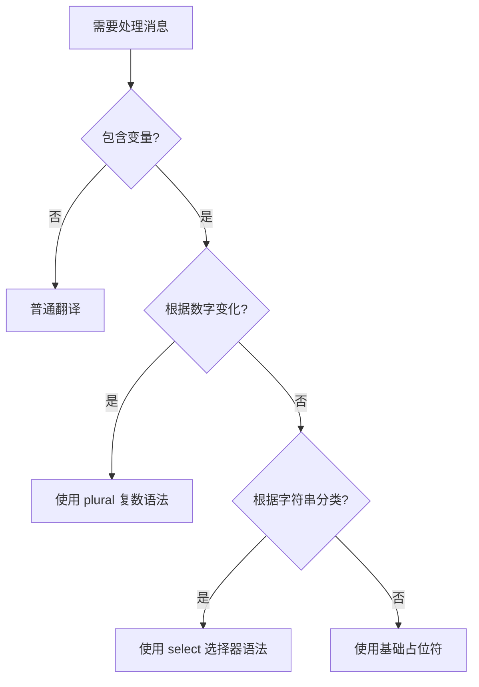

# 第 03 章：占位符、复数与选择器

## 1. 简介

在国际化过程中，简单的静态字符串往往不够。你可能需要在翻译中插入变量（如用户名）、处理数字的复数形式（如“1 个苹果”与“5 个苹果”），或者根据性别等分类选择不同的措辞。

## 2. 占位符 (Placeholders)

占位符允许你在翻译中嵌入变量。

### 2.1 定义占位符

在 ARB 文件中，使用花括号 `{}` 定义变量名，并在 `@key` 节点中说明变量的类型。

```json 377:388:src/content/ui/internationalization/index.md
"hello": "Hello {userName}",
"@hello": {
  "description": "A message with a single parameter",
  "placeholders": {
    "userName": {
      "type": "String",
      "example": "Bob"
    }
  }
}
```

### 2.2 在代码中使用

生成工具会将占位符转换为方法的参数：

```dart 404:404:src/content/ui/internationalization/index.md
Text(AppLocalizations.of(context)!.hello('John')),
```

## 3. 复数 (Plurals)

不同语言对复数的处理规则各不相同。Flutter 支持标准的 ICU 复数语法。

### 3.1 复数关键字

常见的复数形式包括：

* `=0`: 零
* `=1`: 一个
* `=2`: 两个
* `few`: 少数
* `many`: 多数
* `other`: 其他（必须提供）

### 3.2 定义复数消息

```json 439:449:src/content/ui/internationalization/index.md
"nWombats": "{count, plural, =0{no wombats} =1{1 wombat} other{{count} wombats}}",
"@nWombats": {
  "description": "A plural message",
  "placeholders": {
    "count": {
      "type": "num",
      "format": "compact"
    }
  }
}
```

### 3.3 在代码中使用

```dart 461:465:src/content/ui/internationalization/index.md
// 返回 'no wombats'
Text(AppLocalizations.of(context)!.nWombats(0)),
// 返回 '1 wombat'
Text(AppLocalizations.of(context)!.nWombats(1)),
// 返回 '5 wombats'
Text(AppLocalizations.of(context)!.nWombats(5)),
```

## 4. 选择器 (Selects)

选择器通常用于处理基于字符串类别的消息（如性别或状态）。

### 4.1 定义选择器

```json 485:494:src/content/ui/internationalization/index.md
"pronoun": "{gender, select, male{he} female{she} other{they}}",
"@pronoun": {
  "description": "A gendered message",
  "placeholders": {
    "gender": {
      "type": "String"
    }
  }
}
```

### 4.2 在代码中使用

```dart 507:511:src/content/ui/internationalization/index.md
// 返回 'he'
Text(AppLocalizations.of(context)!.pronoun('male')),
// 返回 'she'
Text(AppLocalizations.of(context)!.pronoun('female')),
// 返回 'they'
Text(AppLocalizations.of(context)!.pronoun('other')),
```

> [!WARNING]
> 选择器的匹配是**区分大小写**的。如果传入 `"Male"`，由于不匹配 `"male"`，将退回到 `other` 情况。

## 5. 转义语法 (Escaping)

如果你需要在翻译文本中显示 `{` 或 `}` 等特殊字符，需要启用转义。

### 5.1 启用转义

在 `l10n.yaml` 中添加：

```yaml
use-escaping: true
```

### 5.2 使用单引号转义

使用成对的单引号包裹需要忽略的字符。如果需要显示单引号本身，请使用连续两个单引号。

```json 542:544:src/content/ui/internationalization/index.md
{
  "helloWorld": "Hello! '{Isn''t}' this a wonderful day?"
}
```

生成后的 Dart 字符串为：`"Hello! {Isn't} this a wonderful day?"`。

## 6. 特性处理决策逻辑图



## 7. 常见问题解答

**Q: `type` 可以指定哪些类型？**

A: 常见的包括 `String`、`num`、`int`、`double`、`DateTime`。对于 `num` 和 `DateTime` 类型，还可以配合 `format` 参数进行格式化（详见后续教程）。

**Q: 为什么复数消息必须包含 `other` 情况？**

A: 这是 ICU 语法的要求，确保在任何给定的数字输入下都能有一个默认的翻译输出，防止程序崩溃。
