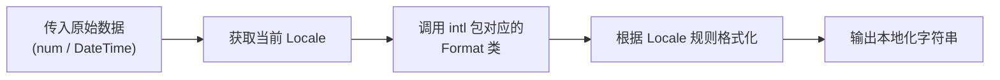

# 第 04 章：数字、货币与日期格式化

## 1. 简介

在不同的文化和地区中，数字、货币和日期的显示方式差异巨大。例如，美国使用 `7/9/1959`，而俄罗斯使用 `9.07.1959`。Flutter 的 `gen-l10n` 工具集成了 `intl` 包中的 `NumberFormat` 和 `DateFormat` 类，帮助你自动处理这些差异。

## 2. 数字与货币格式化

通过在 ARB 文件的占位符定义中指定 `format` 属性，可以自动应用格式化逻辑。

### 2.1 常用格式对照表

| 格式名称 (format) | 输入示例 (1,200,000) | 输出效果 |
| --------------- | ------------------- | ------- |
| `compact` | 1200000 | "1.2M" |
| `compactCurrency` | 1200000 | "$1.2M" |
| `decimalPattern` | 1200000 | "1,200,000" |
| `currency` | 1200000 | "USD1,200,000.00" |
| `percentPattern` | 1 | "100%" |

### 2.2 定义带参数的格式化

你可以使用 `optionalParameters` 来微调格式化行为。

```json 593:605:src/content/ui/internationalization/index.md
"numberOfDataPoints": "Number of data points: {value}",
"@numberOfDataPoints": {
  "description": "A message with a formatted int parameter",
  "placeholders": {
    "value": {
      "type": "int",
      "format": "compactCurrency",
      "optionalParameters": {
        "decimalDigits": 2
      }
    }
  }
}
```

## 3. 日期格式化

日期格式化需要将占位符类型设置为 `DateTime`。

### 3.1 定义日期翻译

```json 624:633:src/content/ui/internationalization/index.md
"helloWorldOn": "Hello World on {date}",
"@helloWorldOn": {
  "description": "A message with a date parameter",
  "placeholders": {
    "date": {
      "type": "DateTime",
      "format": "yMd"
    }
  }
}
```

### 3.2 在代码中使用

```dart 641:641:src/content/ui/internationalization/index.md
AppLocalizations.of(context).helloWorldOn(DateTime.utc(1959, 7, 9))
```

**效果对比**：

* **美国英语 (en_US)**：输出 `7/9/1959`。
* **俄罗斯语 (ru_RU)**：输出 `9.07.1959`。

### 3.3 常用日期格式构造函数

`DateFormat` 提供了约 41 种预定义的构造函数名，常用的包括：

* `yMd`: 年/月/日 (如 7/9/1959)
* `yMMMMd`: 年月日全称 (如 July 9, 1959)
* `Hm`: 24 小时制时间 (如 14:30)

## 4. 格式化执行流程



## 5. 常见问题解答

**Q: 为什么我设置了 `currency` 但显示的符号不对？**

A: `NumberFormat` 的符号是根据当前的 `Locale` 决定的。如果你希望强制显示某种货币符号，可以在 `optionalParameters` 中设置 `symbol` 或 `name`。

**Q: 是否支持自定义的日期格式字符串（如 "yyyy-MM-dd"）？**

A: `gen-l10n` 工具目前主要支持 `DateFormat` 的工厂构造函数名。如果你需要非常特殊的格式，建议在 ARB 中只获取原始字符串，然后在 Dart 代码中手动使用 `DateFormat('yyyy-MM-dd').format(date)` 进行处理。
