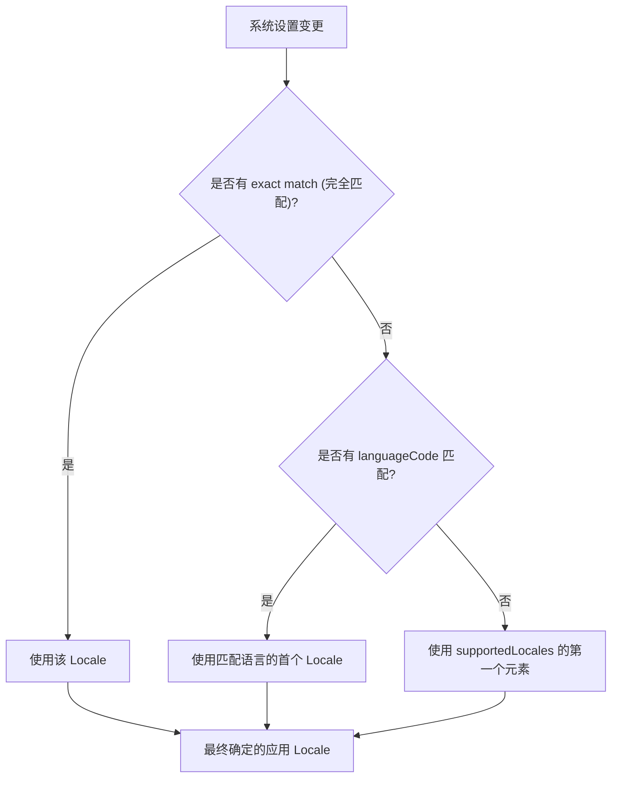

# 第 05 章：高级配置与平台适配

## 1. 简介

在完成基础翻译后，你可能需要处理一些复杂场景，例如适配 iOS 平台的语言声明、处理像中文这样具有多种变体（简繁体、地区差异）的语言，以及自定义应用如何根据系统设置选择最佳语言。

## 2. iOS 平台特定配置

虽然 Flutter 负责应用内部的翻译，但 iOS 系统需要知道应用支持哪些语言，以便在 App Store 中显示正确的语言列表，并让系统弹出框（如权限请求）显示正确的语言。

### 2.1 更新 Xcode 项目

1. 打开项目的 `ios/Runner.xcodeproj`。
2. 在 **Project Navigator** 中选择 `Runner` 项目。
3. 点击 **Info** 选项卡。
4. 在 **Localizations** 部分，点击 **+** 号添加支持的语言。
5. 在弹出的对话框中点击 **Finish** 即可。

Xcode 会自动创建 `.strings` 文件并更新工程文件，这相当于向 iOS 声明了应用的多语言能力。

## 3. 高级 Locale 定义

某些语言不仅有语言代码，还有脚本代码（Script Code）和国家代码（Country Code）。中文是一个典型的例子。

### 3.1 中文变体示例

为了完美支持中国大陆（简体）、台湾（繁体）和香港（繁体），你需要更细致地定义 `Locale`：

```dart 698:723:src/content/ui/internationalization/index.md
supportedLocales: [
  Locale.fromSubtags(languageCode: 'zh'), // 通用中文
  Locale.fromSubtags(
    languageCode: 'zh',
    scriptCode: 'Hans',
  ), // 通用简体中文
  Locale.fromSubtags(
    languageCode: 'zh',
    scriptCode: 'Hant',
  ), // 通用繁体中文
  Locale.fromSubtags(
    languageCode: 'zh',
    scriptCode: 'Hans',
    countryCode: 'CN',
  ), // 中国大陆简体
  Locale.fromSubtags(
    languageCode: 'zh',
    scriptCode: 'Hant',
    countryCode: 'TW',
  ), // 台湾繁体
  Locale.fromSubtags(
    languageCode: 'zh',
    scriptCode: 'Hant',
    countryCode: 'HK',
  ), // 香港繁体
],
```

通过这种方式，Flutter 能够精准匹配用户的偏好，避免出现不地道的翻译。

## 4. Locale 追踪与解析逻辑

### 4.1 获取当前 Locale

你可以随时通过 `BuildContext` 获取应用当前的区域设置：

```dart 765:765:src/content/ui/internationalization/index.md
Locale myLocale = Localizations.localeOf(context);
```

### 4.2 自定义解析逻辑

默认情况下，Flutter 会尝试在 `supportedLocales` 中寻找最匹配的项。如果找不到，则使用列表中的第一个。你可以通过 `localeResolutionCallback` 自定义这个匹配过程。

```dart 797:802:src/content/ui/internationalization/index.md
MaterialApp(
  localeResolutionCallback: (locale, supportedLocales) {
    // 逻辑示例：无条件接受用户选择的 locale
    return locale;
  },
);
```

## 5. Locale 解析流程图



## 6. 常用配置项汇总 (l10n.yaml)

除了基础配置，`l10n.yaml` 还支持许多高级选项：

| 选项 | 说明 |
| --- | --- |
| `synthetic-package` | 是否生成为合成包（默认 true）。设为 false 则在指定目录生成。 |
| `use-deferred-loading` | 是否在 Web 端延迟加载翻译文件，可减少初始包大小。 |
| `nullable-getter` | `Localizations.of` 的 getter 是否可为空（默认 true）。 |
| `preferred-supported-locales` | 指定生成 `supportedLocales` 列表时的首选顺序。 |

## 7. 常见问题解答

**Q: 我在 `supportedLocales` 中添加了新语言，但在模拟器上没生效？**

A: 请检查你的模拟器/真机系统设置。Flutter 会根据系统的首选语言顺序来选择。如果你没有在 iOS 的 Xcode 中配置对应的语言，系统可能会认为应用不支持该语言。

**Q: 如何处理不支持的 Locale？**

A: 你可以使用 `localeResolutionCallback`。例如，如果用户的系统语言是法语但你的应用不支持，你可以在回调中返回一个默认的 `Locale('en')`。
