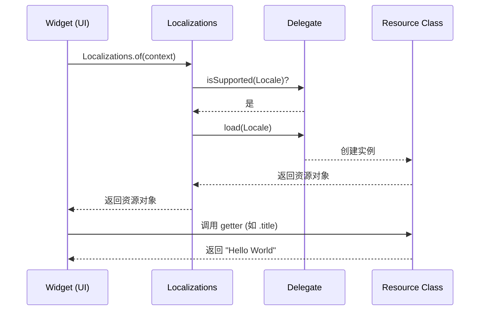

# 第 06 章：底层原理与手动工作流

## 1. 简介

理解 Flutter 国际化的底层机制不仅有助于调试，还能让你根据特定需求自定义国际化方案。本章节将深入探讨 `Localizations` 及其相关类的工作原理，并介绍不使用 `gen-l10n` 工具时的手动工作流。

## 2. 底层原理：InheritedWidget

Flutter 的国际化是基于 `InheritedWidget` 实现的。

### 2.1 查找逻辑

当你在代码中调用 `Localizations.of<T>(context, T)` 时，Flutter 会在 Widget 树中向上查找最近的 `Localizations` 组件。

### 2.2 自动更新

`Localizations` 组件就像一个特殊的 `InheritedWidget`。当系统区域设置（Locale）改变时，`Localizations` 会重新构建。所有依赖于该组件的 Widget（即调用了 `Localizations.of` 的组件）都会自动触发重绘，从而显示新语言的文本。

## 3. 核心组件的角色

### 3.1 LocalizationsDelegate

这是一个抽象类，定义了如何加载特定语言的资源。你需要实现以下方法：

* **`isSupported(Locale locale)`**：判断该代理是否支持某个区域设置。
* **`load(Locale locale)`**：异步加载资源并返回一个包含翻译的对象。
* **`shouldReload`**：决定代理是否需要重新加载（通常返回 `false`）。

### 3.2 资源类 (Resource Class)

这是你真正存放翻译内容的地方。它可以是一个简单的 Map，也可以是使用 `intl` 包定义的复杂类。

## 4. 手动实现示例 (不依赖 gen-l10n)

如果你的应用非常小，或者你想完全控制翻译过程，可以手动定义资源类和代理。

### 4.1 定义资源类

```dart 1184:1204:src/content/ui/internationalization/index.md
class DemoLocalizations {
  DemoLocalizations(this.locale);

  final Locale locale;

  static DemoLocalizations of(BuildContext context) {
    return Localizations.of<DemoLocalizations>(context, DemoLocalizations)!;
  }

  static const _localizedValues = <String, Map<String, String>>{
    'en': {'title': 'Hello World'},
    'es': {'title': 'Hola Mundo'},
  };

  static List<String> languages() => _localizedValues.keys.toList();

  String get title {
    return _localizedValues[locale.languageCode]!['title']!;
  }
}
```

### 4.2 定义代理

```dart 1212:1230:src/content/ui/internationalization/index.md
class DemoLocalizationsDelegate
    extends LocalizationsDelegate<DemoLocalizations> {
  const DemoLocalizationsDelegate();

  @override
  bool isSupported(Locale locale) =>
      DemoLocalizations.languages().contains(locale.languageCode);

  @override
  Future<DemoLocalizations> load(Locale locale) {
    // 因为没有异步操作，直接返回 SynchronousFuture
    return SynchronousFuture<DemoLocalizations>(DemoLocalizations(locale));
  }

  @override
  bool shouldReload(DemoLocalizationsDelegate old) => false;
}
```

## 5. 资源查找时序图

以下展示了应用如何加载并获取一个翻译字符串：



## 6. 使用原生的 intl 命令行工具

除了 `gen-l10n`，你还可以直接使用 `intl` 包提供的命令行工具来提取和生成翻译。

### 6.1 提取文本到 ARB

```bash
dart run intl_translation:extract_to_arb --output-dir=lib/l10n lib/main.dart
```

### 6.2 根据 ARB 生成代码

```bash
$ dart run intl_translation:generate_from_arb \
    --output-dir=lib/l10n --no-use-deferred-loading \
    lib/main.dart lib/l10n/intl_*.arb
```

这种方式更加灵活，但配置和维护成本也更高。

## 7. 常见问题解答

**Q: `SynchronousFuture` 有什么用？**

A: 当你的翻译资源已经全部在内存中（如上述 Map 示例），不需要网络或文件 IO 时，使用 `SynchronousFuture` 可以避免不必要的异步延迟，提高性能。

**Q: 为什么 `localizationsDelegates` 是一个列表？**

A: 因为一个应用可以有多个翻译来源。例如，Flutter 核心组件提供一部分翻译，你自己的业务逻辑提供另一部分，甚至你引用的第三方插件也可以提供自己的翻译。
